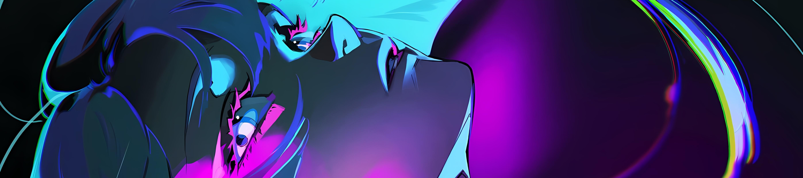

  <a href="./README.md">English</a> | 简体中文

<!-- Banner -->

  

<!-- Title -->
<h1 align="center">
  🌇 Hi, I'm Twilight
</h1>

  <b>前端开发 · Vue3 · TypeScript · Flutter · React</b>

  <i>在代码、创造力与 AI 之间，构建更美观的交互界面。</i>

<!-- Typing effect -->

  <picture>
    <source
      media="(prefers-color-scheme: dark)"
      srcset="https://readme-typing-svg.demolab.com?font=Orbitron&size=22&pause=1200&color=9D7BFF&center=true&vCenter=true&width=720&height=45&lines=Frontend+Developer;Vue3+%2B+TypeScript;React+%2B+TypeScript;Flutter+App+Development;Workflow+%26+AI+Explorer;ACGN"
    >
    <source
      media="(prefers-color-scheme: light)"
      srcset="https://readme-typing-svg.demolab.com?font=Orbitron&size=22&pause=1200&color=7C3AED&center=true&vCenter=true&width=720&height=45&lines=Frontend+Developer;Vue3+%2B+TypeScript;React+%2B+TypeScript;Flutter+App+Development;Workflow+%26+AI+Explorer;ACGN"
    >
    
  </picture>

---

### 关于我

<picture>
  <source media="(prefers-color-scheme: dark)" srcset="./assets/dark.png">
  <source media="(prefers-color-scheme: light)" srcset="./assets/light.png">
  
</picture>

- 💻 专注于现代 Web 开发的前端开发者
- 🛠️ 目前主要使用 **Vue3**、**TypeScript** 和 **React**
- 🚀 对 **工作流编排**、**AI Agent** 和 **前端工程化** 感兴趣
- 🌌 喜欢 ACGN

#### 编程语言

  
  
  

#### 框架与工具

  
  
  
  
  
  
  
  

#### 兴趣

  
  
  
  

 

---

### 贡献图

  <picture>
    <source
      media="(prefers-color-scheme: dark)"
      srcset="https://github-readme-activity-graph.vercel.app/graph?username=TWILIGHT-wyf&theme=tokyo-night&hide_border=true&bg_color=0D1117&color=9D7BFF&line=7DD3FC&point=F472B6"
    >
    <source
      media="(prefers-color-scheme: light)"
      srcset="https://github-readme-activity-graph.vercel.app/graph?username=TWILIGHT-wyf&theme=github-light&hide_border=true&bg_color=FFFFFF&color=7C3AED&line=2563EB&point=F472B6"
    >
    
  </picture>

